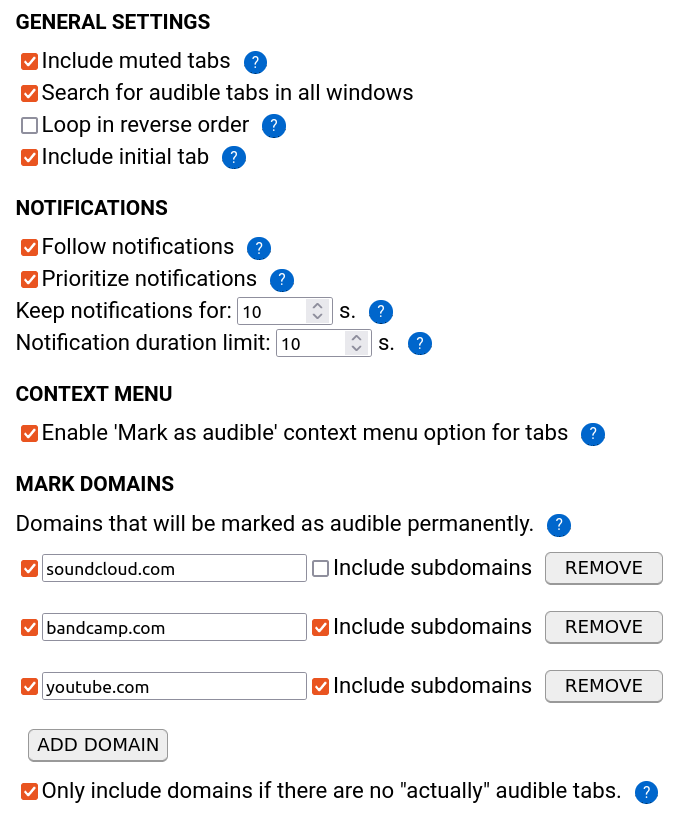

# Switch to audible tab

[Install from AMO](https://addons.mozilla.org/en-US/firefox/addon/switch-to-audible-tab/) / [Gitlab](https://gitlab.com/klntsky/switch-to-audible-tab) / [Github](https://github.com/8084/switch-to-audible-tab)

This WebExtension allows the user to switch to the tab that is currently making sound.

If there are multiple audible tabs, the addon will cycle through them and then return to the initial tab (the latter can be opted off at the settings page).

If there are no audible tabs, the addon will do nothing. Tabs that are muted by the user are also considered audible (this can be changed at the settings page).

If there are audible tabs belonging to other windows, these windows will be switched too (this can be opted off as well).

It is also possible to control the order in which tabs will be visited: available options are left-to-right and right-to-left. This will only make difference if there are more than two tabs in a cycle.

**Alt+Shift+A** can be used instead of the toolbar button.
